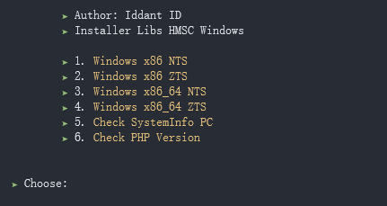

# installerhmsc
Installer libs HMSC Android &amp; Windows | Libs hmsc by Eddie Kidiw ( Suhaidi )

View tools installer hmsc for windows
<center></center>

Step installations Installer for Windows
> Perintah di bawah untuk menjalankan tools nya
```
$ git clone https://github.com/ipkzone/installerhmsc
$ php main.php
```


Step installations Installer for android
> Untuk cek php anda versi berapa ketikan command di bawah ini.
```shell
$ php -v
```


> Response<br>
> PHP 7.4.27 (cli) (built: Dec 14 2021 19:52:13) ( ZTS Visual C++ 2017 x64 )
Copyright (c) The PHP Group<br>
> Berarti Versi PHP kamu versi 7<br>
> Step selanjutnya kamu tinggal cek karnel HP kamu ketikan command di bawah ini.


```shell
$ uname -a
```
> Response<br>
> Linux localhost 4.9.227-perf+ #1 SMP PREEMPT Thu May 5 15:46:07 CST 2022 aarch64 Android<br>
> Berarti karnel kamu adalah (aarch64)<br>
> Lalu jalankan installer anda ikuti command di bawah ini.
```
$ git clone https://github.com/ipkzone/installerhmsc
$ cd Android
$ php installer.php --aarch64_php7
```
Keterangan
> --armv7_php7 ( Untuk PHP versi 7 dengan karnel armv7 )<br>
> --aarch64_php7 ( Untuk PHP versi 7 dengan karnel aarch64 )<br>
> --armv7_php8 ( Untuk PHP versi 8 dengan karnel armv7 )<br>
> --aarch64_php8 ( Untuk PHP versi 8 dengan karnel aarch64 )<br>

