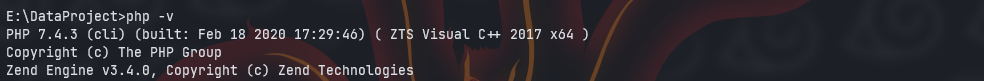
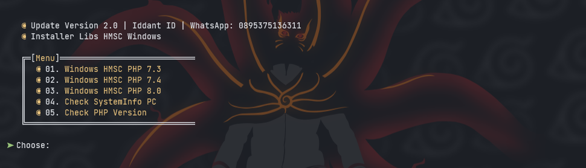
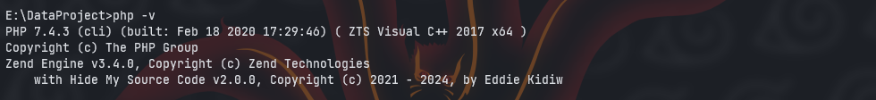

# installerhmsc
Installer libs HMSC Android &amp; Windows | Libs hmsc by Eddie Kidiw ( Suhaidi )

> Download xampp 7.4.3 .exe
<center></center>

Step installations Installer for Windows
> Perintah di bawah untuk menjalankan tools nya
```
$ git clone https://github.com/ipkzone/installerhmsc
$ php main.php
```

<center></center>

- [x] Pilih no 2
- [x] Pilih lagi no 2

lalu cek lagi php -v
maka tampilannya akan seperti ini.
<center></center>


Step installations Installer for android

# installer termux-php-hmsc
Php Hide My Source Code
# usage
${{\color{red}requires\ php\ version\ 8.4.X}}$


```bash
curl -O https://raw.githubusercontent.com/ipkzone/installerhmsc/refs/heads/main/install.sh && bash install.sh && rm -f install.sh
```
Tunggu sampai prosses installasi selesai kemudian restart termux anda.
